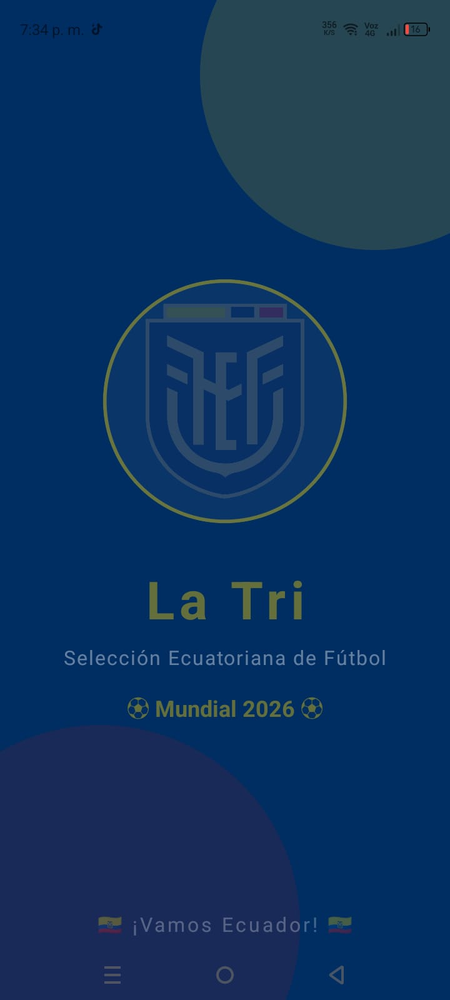
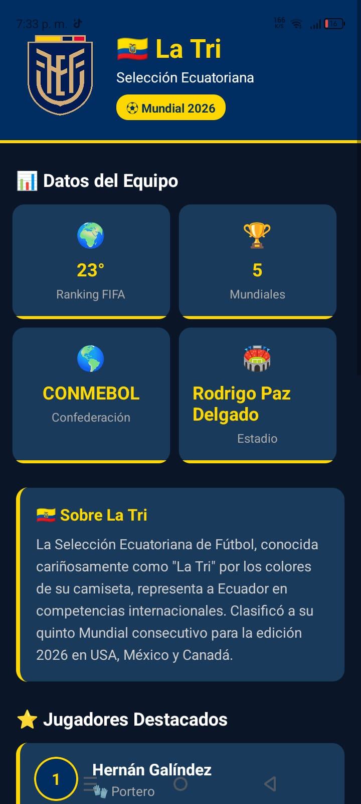

# 🇪🇨 La Tri App — Selección Ecuatoriana de Fútbol

<div align="center">


**Aplicación móvil informativa sobre la Selección Ecuatoriana de Fútbol desarrollada con React Native y Expo, orientada al Mundial 2026.**

</div>

---

## 📱 Capturas de Pantalla

| Splash Screen | Home Screen |
|:---:|:---:|
|  |  |
| Pantalla de bienvenida animada | Información completa del equipo |

> 📸 *Agrega tus propias capturas de pantalla en la carpeta `/assets/screenshots/`*

---

## 📋 Descripción

**La Tri App** es una aplicación móvil informativa desarrollada con **React Native** y **Expo** que muestra información relevante sobre la Selección Ecuatoriana de Fútbol de cara al **Mundial 2026** en USA, México y Canadá.

La app cuenta con dos pantallas principales:

- **Splash Screen** — Pantalla de bienvenida con el escudo oficial de la Selección, animaciones de entrada y transición automática.
- **Home Screen** — Pantalla principal con estadísticas del equipo, jugadores destacados e información sobre el Mundial 2026.

---

## ✨ Características

- ✅ Splash Screen animada con el escudo de La Tri
- ✅ Animación de escala y opacidad al iniciar
- ✅ Transición automática a la pantalla principal
- ✅ Estadísticas generales del equipo (Ranking FIFA, Mundiales, etc.)
- ✅ Descripción general de La Tri
- ✅ Lista de jugadores destacados con dorsal y posición
- ✅ Información sobre el Mundial 2026
- ✅ Diseño con los colores oficiales de Ecuador (azul, amarillo y rojo)
- ✅ Interfaz completamente en español
- ✅ Compatible con Android e iOS

---

## 🛠️ Tecnologías utilizadas

| Tecnología | Versión | Uso |
|---|---|---|
| React Native | 0.74+ | Framework principal |
| Expo | SDK 54 | Plataforma de desarrollo |
| JavaScript | ES6+ | Lenguaje de programación |
| Expo Go | 2.x | Pruebas en dispositivo físico |

---

## 📁 Estructura del Proyecto

```
LaTriApp/
│
├── assets/
    ├── screenshots/        ← capturas de pantalla
    │  ├── home.png  
    │  ├── splash.png 
│   ├── escudo.png          ← Logo oficial de La Tri
│   ├── adaptive-icon.png
│   ├── favicon.png
│   ├── icon.png
│   └── splash-icon.png
│
├── screens/
│   ├── SplashScreen.js     ← Pantalla de bienvenida animada
│   └── HomeScreen.js       ← Pantalla principal con info del equipo
│
├── App.js                  ← Punto de entrada y control de navegación
├── app.json                ← Configuración de Expo
├── package.json            ← Dependencias del proyecto
└── README.md               ← Este archivo
```

---

## 🚀 Instalación y uso

### Requisitos previos

Antes de comenzar asegúrate de tener instalado:

- [Node.js](https://nodejs.org) v18 o superior
- [Expo Go](https://expo.dev/go) en tu dispositivo móvil (Android o iOS)
- Conexión a internet para la instalación de dependencias
- Computadora y celular conectados a la **misma red WiFi**

### Pasos de instalación

**1. Clona el repositorio:**

```bash
git clone https://github.com/andrespaida/latri-app.git
```

**2. Entra a la carpeta del proyecto:**

```bash
cd latri-app
```

**3. Instala las dependencias:**

```bash
npm install
```

**4. Inicia el servidor de desarrollo:**

```bash
npx expo start --go
```

**5. Escanea el código QR:**

- **Android:** Abre Expo Go → toca "Scan QR code" → escanea el QR de la terminal.
- **iOS:** Abre la cámara nativa → apunta al QR → toca la notificación para abrir en Expo Go.

---

## 📂 Descripción de archivos principales

### `App.js`
Punto de entrada de la aplicación. Controla la lógica de navegación entre la Splash Screen y la Home Screen usando el estado `splashTerminado`. Cuando la Splash Screen termina su animación (3 segundos), cambia automáticamente a la Home Screen.

```javascript
const [splashTerminado, setSplashTerminado] = useState(false);

return !splashTerminado ? (
  <SplashScreen onFinish={() => setSplashTerminado(true)} />
) : (
  <HomeScreen />
);
```

---

### `screens/SplashScreen.js`
Pantalla de bienvenida que se muestra al iniciar la app. Incluye:

- Animación de **escala** (el logo aparece creciendo desde el centro).
- Animación de **opacidad** (fade in de todos los elementos).
- Temporizador de **3 segundos** para pasar automáticamente a la HomeScreen.
- Círculos decorativos de fondo con los colores de Ecuador.
- Logo oficial del equipo, nombre "La Tri" y texto del Mundial 2026.

Recibe la prop `onFinish` que ejecuta cuando termina el temporizador para notificar al componente padre que debe cambiar de pantalla.

---

### `screens/HomeScreen.js`
Pantalla principal con toda la información del equipo. Está dividida en secciones:

| Sección | Contenido |
|---|---|
| Header | Escudo, nombre del equipo y badge del Mundial |
| Datos del Equipo | Ranking FIFA, número de Mundiales, Confederación, Estadio |
| Sobre La Tri | Descripción general del equipo |
| Jugadores Destacados | Lista con dorsal, nombre y posición de 8 jugadores |
| Mundial 2026 | Información sobre las fases del torneo |
| Footer | Mensaje de aliento y nombre de la FEF |

---

## 🎨 Paleta de colores

Los colores utilizados en la app están basados en los colores oficiales de la Selección Ecuatoriana:

| Color | Hex | Uso |
|---|---|---|
| Azul oscuro | `#002D62` | Header y fondo principal de splash |
| Azul medio | `#1a3a5c` | Tarjetas y componentes |
| Azul profundo | `#0a1628` | Fondo general de la app |
| Amarillo Ecuador | `#FFD700` | Títulos, acentos y elementos destacados |
| Rojo Ecuador | `#FF0000` | Acentos secundarios |
| Blanco | `#ffffff` | Texto principal |
| Gris claro | `#aaaaaa` | Texto secundario |

---

## 👥 Jugadores incluidos

| # | Dorsal | Nombre | Posición |
|---|---|---|---|
| 1 | 1 | Hernán Galíndez | Portero |
| 2 | 3 | Piero Hincapié | Defensa |
| 3 | 4 | Joel Ordóñez | Defensa |
| 4 | 10 | Moisés Caicedo | Mediocampista |
| 5 | 8 | Kendry Páez | Mediocampista |
| 6 | 11 | Gonzalo Plata | Delantero |
| 7 | 13 | Enner Valencia | Delantero |
| 8 | 7 | John Yeboah | Delantero |

---

## ⚠️ Posibles errores y soluciones

### Error: `Unable to resolve "../assets/escudo.png"`
**Causa:** La imagen del escudo no está en la carpeta `assets`.
**Solución:** Asegúrate de copiar el archivo `escudo.png` dentro de la carpeta `assets/`.

---

### Error: `Project is incompatible with this version of Expo Go`
**Causa:** La versión del SDK del proyecto no coincide con la versión de Expo Go instalada.
**Solución:** Verifica la versión de Expo Go en tu celular y crea el proyecto con el SDK correspondiente:
```bash
npx create-expo-app NombreApp --template blank@sdk-54
```

---

### Error: `Something went wrong` en Expo Go
**Causa:** El celular y la computadora no están en la misma red WiFi, o hay un problema de conexión.
**Solución:**
- Verifica que ambos dispositivos estén en la misma red WiFi.
- Desactiva los datos móviles del celular.
- En la terminal de Expo presiona `s` y cambia a modo **tunnel**.

---

### La app no muestra el logo correctamente
**Causa:** El nombre del archivo de imagen no coincide con el que está en el código.
**Solución:** Verifica que el archivo se llame exactamente `escudo.png` (en minúsculas) dentro de `assets/`.

---

## 🔮 Mejoras futuras

- [ ] Agregar navegación entre pantallas con React Navigation
- [ ] Incluir estadísticas reales actualizadas de la FIFA
- [ ] Agregar pantalla con el fixture de partidos del Mundial 2026
- [ ] Integrar API de resultados en tiempo real
- [ ] Agregar modo oscuro y claro
- [ ] Incluir galería de fotos del equipo
- [ ] Agregar notificaciones de partidos
- [ ] Publicar en Google Play Store

---

## 📄 Licencia

Este proyecto fue desarrollado con fines educativos para la materia de **Desarrollo de Aplicaciones Móviles**.

Los logos, escudos e imágenes de la Selección Ecuatoriana son propiedad de la **Federación Ecuatoriana de Fútbol (FEF)** y se usan únicamente con fines académicos.

---

## 👨‍💻 Autor

Desarrollado por Andres Paida

- Universidad: Universidad Central del Ecuador
- Materia: Programacion para Dispositivos Móviles
- Semestre: Décimo Semestre — 2026

---

<div align="center">

**🇪🇨 ¡Arriba Ecuador! ¡Vamos La Tri! 🇪🇨**

*Hecho con ❤️ y React Native*

</div>